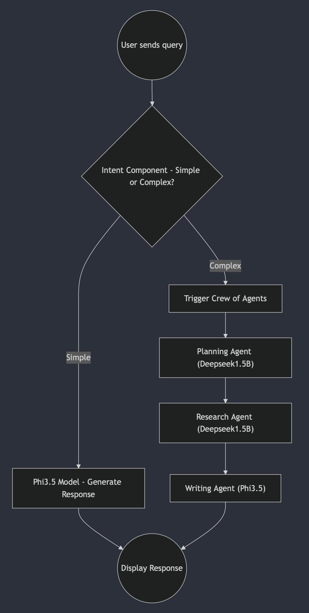

# Local Agentic RAG Application 🧠📚

A privacy-focused Retrieval-Augmented Generation (RAG) system with Agentic Workflows for simplified deep research that runs entirely on your local machine. Built for researchers, students, and professionals who need document analysis without cloud dependencies.



## Key Features ✨

- **Local First** - No data leaves your machine
- **Multi-Agent System** - Specialized agents for:
  - 📋 Task Planning & Decomposition
  - 🔍 Document Research & Analysis
  - ✍️ Response Writing & Synthesis
- **Dual-Model System** - Smart routing between:
  - 🚀 Phi-3.5 (3.8B) for factual queries
  - 🧠 DeepSeek-R1 (1.5B) for complex reasoning
- **Document Management**:
  - PDF ingestion with text/OCR support
  - Vector storage using ChromaDB
  - Full document lifecycle management
- **Privacy Focused** - 100% offline operation
- **Responsive UI** - Gradio-based chat interface with real-time agent progress updates

## Tech Stack ⚙️

| Component           | Technology                        |
| ------------------- | --------------------------------- |
| Language Models     | Ollama (Phi-3.5, DeepSeek-R1)     |
| Embeddings          | Nomic Embed Text                  |
| Vector Store        | ChromaDB                          |
| Document Processing | LangChain, PyPDF, Unstructured.IO |
| Agent Framework     | CrewAI                            |
| UI Framework        | Gradio                            |
| OCR Engine          | Tesseract                         |

## Installation 🛠️

### Prerequisites

- Python 3.9+
- [Ollama](https://ollama.ai/) installed
- Tesseract OCR (for image-based PDFs):
  ```bash
  # MacOS
  brew install tesseract
  # Ubuntu
  sudo apt install tesseract-ocr
  ```
  To install tesseract on Windows, please ref UBMannheim project [link](https://github.com/UB-Mannheim/tesseract/wiki). The installation path (default is `C:/ProgramFiles/Tesseract-OCR`) needs to be an environment variable before it can be used by `pytesseract` python package.

### Setup

1. Clone repository:

   ```bash
   git clone https://github.com/yourusername/local-rag.git
   cd local-rag
   ```

2. Install dependencies:

   ```bash
   pip install -r requirements.txt
   # Windows
   pip install -r requirements_forWindows.txt
   ```

   - Tested on Windows 11 with python 3.12.8

3. Download models:
   ```bash
   ollama pull nomic-embed-text
   ollama pull phi3.5
   ollama pull deepseek-r1:1.5b
   ```

## Usage 🖥️

1. Start the application:

   ```bash
   python app.py
   ```

2. Access the UI at `http://localhost:7860`

3. Workflow:

   - **Upload Documents**:

     - Supported format: PDF
     - Max size: 50MB
     - Both text-based and image PDFs supported

   - **Chat Interface**:

     - Ask natural language questions
     - Real-time agent progress updates
     - Automatic task decomposition and research
     - Detailed source references with page numbers

   - **Document Management**:
     - View ingested documents
     - Delete documents and associated vectors

## Configuration ⚙️

Environment variables (`.env`):
