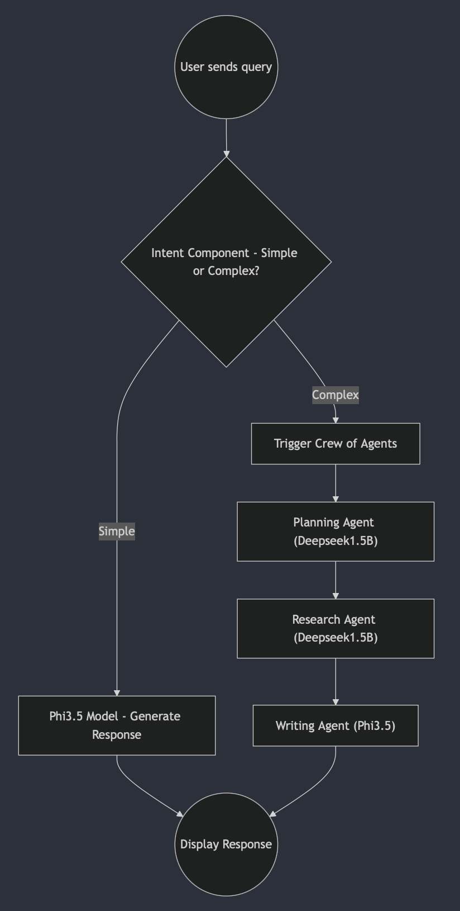

# Local Agentic RAG Application 🧠📚

A privacy-focused Retrieval-Augmented Generation (RAG) system with Agentic Workflows for simplified deep research that runs entirely on your local machine. Built for researchers, students, and professionals who need document analysis without cloud dependencies.



## Key Features ✨

- **Local First** - No data leaves your machine
- **Multi-Agent System** - Specialized agents for:
  - 📋 Task Planning & Decomposition
  - 🔍 Document Research & Analysis
  - ✍️ Response Writing & Synthesis
- **Dual-Model System** - Smart routing between:
  - 🚀 Phi-3.5 (3.8B) for factual queries
  - 🧠 DeepSeek-R1 (1.5B) for complex reasoning
- **Document Management**:
  - PDF ingestion with text/OCR support
  - Vector storage using ChromaDB
  - Full document lifecycle management
- **Privacy Focused** - 100% offline operation
- **Responsive UI** - Gradio-based chat interface with real-time agent progress updates

## Tech Stack ⚙️

| Component           | Technology                        |
| ------------------- | --------------------------------- |
| Language Models     | Ollama (Phi-3.5, DeepSeek-R1)     |
| Embeddings          | Nomic Embed Text                  |
| Vector Store        | ChromaDB                          |
| Document Processing | LangChain, PyPDF, Unstructured.IO |
| Agent Framework     | CrewAI                            |
| UI Framework        | Gradio                            |
| OCR Engine          | Tesseract                         |

## Installation 🛠️

This project requires Python 3.9+ and several external tools. Please ensure all prerequisites are met before proceeding.

### Prerequisites

1.  **Python 3.9+**:
    *   Ensure Python 3.9 or a later version is installed and accessible from your terminal. You can download it from [python.org](https://www.python.org/downloads/).

2.  **Ollama**:
    *   Install Ollama from [ollama.ai](https://ollama.ai/).
    *   After installation, ensure the Ollama application is running in the background.
    *   Pull the required models by running the following commands in your terminal:
        ```bash
        ollama pull nomic-embed-text
        ollama pull phi3.5
        ollama pull deepseek-r1:1.5b
        ```

3.  **Tesseract OCR**:
    *   This is required for processing image-based PDFs or PDFs with non-selectable text.
    *   **macOS**: Install using Homebrew:
        ```bash
        brew install tesseract
        ```
    *   **Ubuntu/Debian**: Install using apt:
        ```bash
        sudo apt install tesseract-ocr
        ```
    *   **Windows**:
        *   Download and install from the [UB-Mannheim Tesseract project](https://github.com/UB-Mannheim/tesseract/wiki).
        *   **Crucial**: After installation, add the Tesseract installation directory (e.g., `C:\Program Files\Tesseract-OCR`) to your system's PATH environment variable.
    *   Verify Tesseract installation by typing `tesseract --version` in your terminal.

### Quick Setup with Scripts (Recommended)

For a streamlined setup, you can use the provided scripts to create a virtual environment and install Python dependencies. Make sure you've met all the **Prerequisites** listed above first, especially Ollama and Tesseract.

1.  **Clone the repository**:
    ```bash
    git clone https://github.com/yourusername/local-rag.git # Replace with actual repo URL if known
    cd local-rag
    ```

2.  **Run the setup script for your OS**:

    *   **Linux/macOS**:
        Open your terminal and run:
        ```bash
        bash setup.sh
        ```
        (If you prefer, make it executable first: `chmod +x setup.sh && ./setup.sh`)
        The script will guide you through creating a virtual environment and installing dependencies from `requirements.txt`.

    *   **Windows**:
        Open Command Prompt or PowerShell and run:
        ```bat
        setup.bat
        ```
        (You might be able to double-click `setup.bat` from File Explorer as well.)
        The script will guide you through creating a virtual environment and installing dependencies from `requirements_forWindows.txt`.

    Both scripts will also remind you of the manual prerequisites.

### Manual Setup Instructions

If you prefer to set up the environment manually:

1.  **Clone the repository** (if not already done):
    ```bash
    git clone https://github.com/yourusername/local-rag.git # Replace with actual repo URL if known
    cd local-rag
    ```

2.  **Create and activate a virtual environment** (recommended):
    *   Using `venv`:
        ```bash
        python3 -m venv .venv
        source .venv/bin/activate  # On Linux/macOS
        # .\.venv\Scripts\activate  # On Windows
        ```
    *   Or using Conda:
        ```bash
        conda create -n localrag_env python=3.9
        conda activate localrag_env
        ```

3.  **Install dependencies**:
    *   For Linux/macOS (from the project root directory):
        ```bash
        pip install -r requirements.txt
        ```
    *   For Windows (from the project root directory):
        It's recommended to use `requirements_forWindows.txt` as it may contain specific versions or packages for Windows compatibility.
        ```bash
        pip install -r requirements_forWindows.txt
        ```
        *Note: The `requirements.txt` is primarily tested for Linux/macOS and `requirements_forWindows.txt` for Windows 11 with Python 3.12.*

## Usage 🖥️

1.  **Ensure Prerequisites are Running**:
    *   Ollama application is running.
    *   Tesseract OCR is installed and in PATH (if you plan to use OCR).

2.  **Activate the virtual environment** (if not already active):
    ```bash
    source .venv/bin/activate  # On Linux/macOS
    # .\.venv\Scripts\activate  # On Windows
    # conda activate localrag_env # If using Conda
    ```

3.  **Start the application**:
    From the project root directory:
    ```bash
    python app.py
    ```

4.  **Access the UI**:
    Open your web browser and go to `http://localhost:7860` (or the port shown in the console if different).

## Configuration ⚙️

Environment variables (`.env`):
(Note: This section seems incomplete in the original, if there are .env configurations, they should be listed here. Assuming it's a placeholder for now or to be filled later.)

```
# Example .env content (if any)
# RAG_CONFIG_OPTION=value
```

## Workflow 🚀

   - **Upload Documents**:

     - Supported format: PDF
     - Max size: 50MB (configurable in `config.py`)
     - Both text-based and image PDFs supported (requires Tesseract for image-based)

   - **Chat Interface**:

     - Ask natural language questions
     - Real-time agent progress updates for complex queries
     - Automatic task decomposition and research by AI agents
     - Detailed source references with page numbers (where applicable)

   - **Document Management**:
     - View ingested documents
     - Delete documents and associated vectors directly from the UI

## Troubleshooting Tips 🔍

*   **Ollama Issues**:
    *   Ensure Ollama is running. You can check by visiting `http://localhost:11434` in your browser or using `ollama list` in the terminal.
    *   If models fail to download with `ollama pull`, check your internet connection and Ollama logs.
*   **Tesseract not found (Windows)**:
    *   The most common issue is not adding Tesseract to the PATH. Double-check your environment variables. You may need to restart your terminal or PC after setting the PATH.
    *   You can test if pytesseract can find Tesseract by running a simple Python script:
        ```python
        import pytesseract
        try:
            print(pytesseract.get_tesseract_version())
        except Exception as e:
            print(f"Tesseract not found or error: {e}")
        ```
*   **Dependency Installation Errors**:
    *   On Windows, some packages might require Microsoft C++ Build Tools. If you see errors related to `torch` or other complex packages, install them from [Visual Studio Downloads](https://visualstudio.microsoft.com/visual-cpp-build-tools/).
    *   Ensure you are using the correct `requirements` file for your OS.
*   **`Failed to initialize RAG chain` or `ModelError`**:
    *   This usually means an issue connecting to Ollama or loading the specified models. Verify Ollama is running and the models (`nomic-embed-text`, `phi3.5`, `deepseek-r1:1.5b`) are pulled and accessible.
    *   Check the `config.py` file to ensure model names match what Ollama has.

## Contributing 🤝

Contributions are welcome! Please fork the repository, create a feature branch, and submit a pull request. For major changes, please open an issue first to discuss what you would like to change.

## License 📄

This project is licensed under the MIT License - see the [LICENSE](LICENSE) file for details (assuming a LICENSE file will be added).
